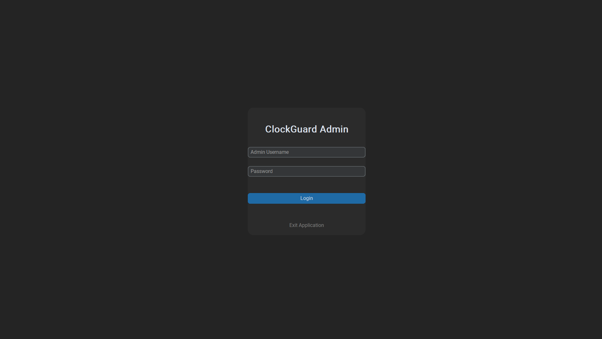
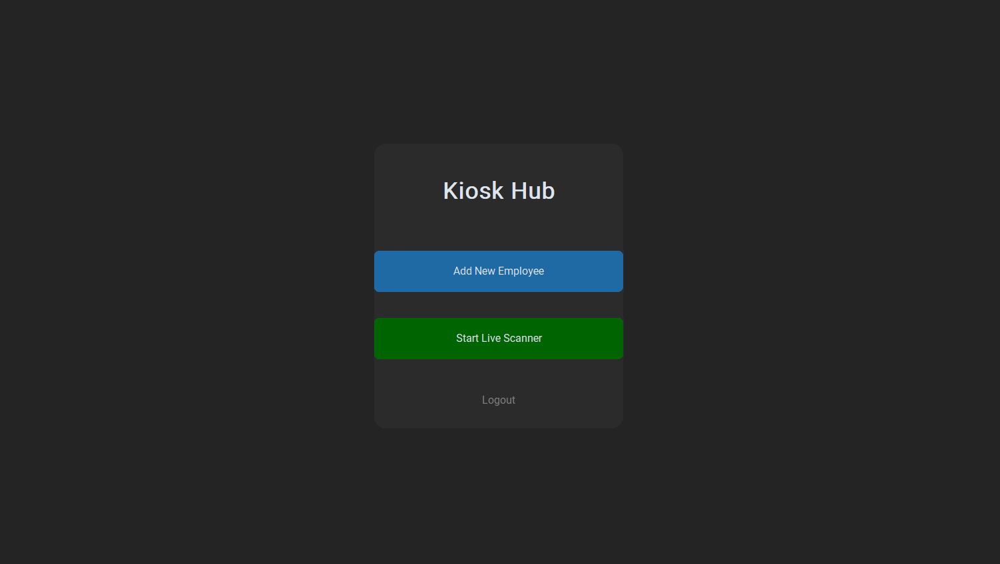

```markdown
# Feature Spec: Scanner Hub
**Author:** Dave Persaud
**Created:** 03/23/2026
**Last Updated:** 03/23/2026  
**Status:**Approved

---

## Overview
The Scanner Hub is the home for the clock in/out proccess. Once booted, the admin will have to login with valid credentials, creating a session to that specific organization. Then, they will be prompted to either to register a new employee or start the live scanner. 

REGISTRATION MODES

Registration Mode (mode="register"):

Uses CTkInputDialog to capture Employee Name, Email, and Hourly Rate sequentially.

Requires the user to pass liveness validation before capturing 5 distinct frames.

Averages the 5 extracted FaceNet vectors into a single 512-d master vector, normalizes it, and POSTs the JSON payload to the backend.

Scanner Mode (mode="scanner"):

Continuously evaluates frames. Upon a successful liveness check, extracts the 512-d vector.

Threaded API Calls: To ensure the camera FPS doesn't stutter while waiting for the FastAPI backend, the /verify POST request is wrapped in a dedicated background thread (threading.Thread(target=verify_backend).start()).

## Goals
- What problem does this solve?
    This hub connects both the register employee and live scanner scripts into one, allowing ease of access for the admin at the start of workdays

## Mockups / Wireframes
```



```markdown
## Technical Notes
- A global api_session is instantiated at runtime. Upon successful admin login, the session automatically stores the JWT/Secure Cookie, ensuring subsequent requests (like employee verification or registration) are authenticated without passing tokens manually.

- On startup, the __main__ block spawns a hidden root window to prompt the user for the boot configuration: Secure Kiosk Mode or Dev Mode.

## Acceptance Criteria
- [ ] Criterion 1
- [ ] Criterion 2
- [ ] Criterion 3